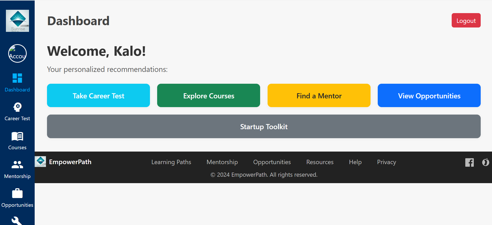

# Refugees Techpreneurs- Capstone Project

A full stack web application designed to empower refugees by providing personalized career paths, mentorship, learning resources, and access to opportunities.

---

## 📖 Description

Refugees Techpreneurs is a platform that helps refugees build brighter futures by:
- Recommending personalized career paths using AI
- Connecting users with mentors
- Offering interactive learning modules and toolkits
- Providing access to scholarships, jobs, and startup resources

---

## 🔗 GitHub Repository

[GitHub Repo Link](https://github.com/SabirWalid/Capstone-project) 

---

## ⚙️ Environment & Project Setup

### **Backend Setup**
1. **Clone the repository:**
   ```sh
   git clone https://github.com/SabirWalid/Capstone-project.git
   cd Capstone-project/backend
   ```sh

2. **Install dependencies**
   ```sh
   npm install

3. **Set up environment variaables**
   ```sh
   Create .env file in your backend folder

   MONGO_URI=mongodb://localhost:27017/refugee_app
   PORT=5000

4. **Start MongoDB:**
   ```sh
   Make sure MongoDB is running locally (use MongoDB Compass or run mongod).
5. **Run the backend server**
   ```sh
   node server.js

**Frontend Setup**

1. **Naviaget to the frontend folder:**
   ```sh
   cd frontend/public

   Open index,html in your browser(You can use Live Server extension in VS Code for a better experience.)

**Mockups Figma:**

https://www.figma.com/design/DkTzOiGUHFvHzZv7aJrWPU/Untitled?node-id=0-1&p=f&t=wbjf9tmkyikpMNqS-0

**Screensshots:**

     


 



## 🚀 **Deployment Plan**

1. **Backend Deployment**
   ```sh
   Deploy the backend to a cloud service Heroku, Railway.
   Set up environment variables for production MongoDB Compass.
   Ensure CORS is configured to allow frontend requests.

2. **Frontend Deployment**
   ```sh
   Host static files on Netlify, or GitHub Pages.
   Update API URLs in frontend JS to point to the deployed backend.

3. **Domain & SSL**
   ```sh
   Connect a custom domain if needed.
   Ensure HTTPS is enabled.

4. **Monitoring & Maintenance**
   ```sh
   Set up logging and error monitoring (e.g., Sentry, LogRocket).
   Regularly update dependencies and monitor security.

## 📞 **Contact**
   ```sh
   For questions or contributions, please open an issue or pull request on the GitHub repo https://github.com/SabirWalid/Capstone-project.


**Demo Video**
   ```sh
   https://youtu.be/4_8D3hckKVY