# Activity Diagrams

## 1. Complete User Journey - From Registration to Career Success

```mermaid
flowchart TD
    Start([User Visits Platform]) --> CheckAuth{Returning User?}
    
    CheckAuth -->|No| Registration[User Registration Process]
    CheckAuth -->|Yes| Login[User Login]
    
    Registration --> EmailVerify[Email Verification]
    EmailVerify --> ProfileSetup[Complete Profile Setup]
    ProfileSetup --> Dashboard[Navigate to Dashboard]
    
    Login --> Dashboard
    
    Dashboard --> ChooseAction{Choose Primary Action}
    
    ChooseAction -->|Career Guidance| CareerAssessment[Take Career Assessment]
    ChooseAction -->|Learn Skills| BrowseCourses[Browse Learning Modules]
    ChooseAction -->|Find Mentor| FindMentor[Search for Mentors]
    ChooseAction -->|Job Search| BrowseOpportunities[Browse Opportunities]
    ChooseAction -->|Start Business| BusinessPlan[Access Startup Resources]
    
    %% Career Assessment Path
    CareerAssessment --> FillSkills[Fill Skills & Experience]
    FillSkills --> SelectInterests[Select/Add Interests]
    SelectInterests --> ProcessAI[AI Processes Assessment]
    ProcessAI --> ViewRecommendations[View Career Recommendations]
    ViewRecommendations --> BookmarkCareers[Bookmark Preferred Careers]
    BookmarkCareers --> LearningPlan[Generate Learning Plan]
    
    %% Learning Path
    BrowseCourses --> FilterCourses[Filter by Career/Interest]
    FilterCourses --> SelectModule[Select Learning Module]
    SelectModule --> StudyContent[Study Content]
    StudyContent --> TakeQuiz[Take Assessment Quiz]
    TakeQuiz --> PassQuiz{Pass Quiz?}
    PassQuiz -->|No| ReviewMaterial[Review Material]
    ReviewMaterial --> TakeQuiz
    PassQuiz -->|Yes| ModuleComplete[Module Completed]
    ModuleComplete --> GetCertificate[Receive Certificate]
    GetCertificate --> NextModule{More Modules?}
    NextModule -->|Yes| SelectModule
    NextModule -->|No| SkillsUpdated[Skills Profile Updated]
    
    %% Mentorship Path
    FindMentor --> FilterMentors[Filter by Expertise]
    FilterMentors --> ViewProfile[View Mentor Profiles]
    ViewProfile --> SendRequest[Send Mentorship Request]
    SendRequest --> WaitApproval[Wait for Mentor Response]
    WaitApproval --> RequestApproved{Request Approved?}
    RequestApproved -->|No| FindAlternative[Find Alternative Mentor]
    FindAlternative --> FilterMentors
    RequestApproved -->|Yes| ScheduleMeeting[Schedule First Meeting]
    ScheduleMeeting --> MentorshipSession[Attend Mentorship Session]
    MentorshipSession --> SessionFeedback[Provide Session Feedback]
    SessionFeedback --> ContinueMentorship{Continue Mentorship?}
    ContinueMentorship -->|Yes| ScheduleNext[Schedule Next Session]
    ScheduleNext --> MentorshipSession
    ContinueMentorship -->|No| CompleteMentorship[Complete Mentorship Program]
    
    %% Opportunities Path
    BrowseOpportunities --> FilterOpportunities[Filter by Career/Location]
    FilterOpportunities --> ViewJob[View Job Details]
    ViewJob --> CheckEligibility[Check Eligibility Requirements]
    CheckEligibility --> Eligible{Meet Requirements?}
    Eligible -->|No| IdentifyGaps[Identify Skill Gaps]
    IdentifyGaps --> LearningPlan
    Eligible -->|Yes| ApplyJob[Apply for Opportunity]
    ApplyJob --> TrackApplication[Track Application Status]
    TrackApplication --> ApplicationResult{Application Result}
    ApplicationResult -->|Interview| PrepareInterview[Interview Preparation]
    PrepareInterview --> AttendInterview[Attend Interview]
    AttendInterview --> InterviewResult{Interview Result}
    InterviewResult -->|Success| JobOffer[Receive Job Offer]
    InterviewResult -->|Rejected| LearnFromFeedback[Learn from Feedback]
    LearnFromFeedback --> IdentifyGaps
    ApplicationResult -->|Rejected| LearnFromFeedback
    
    %% Business Path
    BusinessPlan --> AssessIdea[Assess Business Idea]
    AssessIdea --> MarketResearch[Conduct Market Research]
    MarketResearch --> CreatePlan[Create Business Plan]
    CreatePlan --> AccessResources[Access Funding Resources]
    AccessResources --> NetworkBuilding[Build Professional Network]
    NetworkBuilding --> LaunchBusiness[Launch Business]
    
    %% Convergence Points
    LearningPlan --> BrowseCourses
    SkillsUpdated --> UpdateProfile[Update Skills Profile]
    CompleteMentorship --> UpdateProfile
    JobOffer --> Success[Career Success Achieved]
    LaunchBusiness --> Success
    
    UpdateProfile --> ReassessCareer{Reassess Career Goals?}
    ReassessCareer -->|Yes| CareerAssessment
    ReassessCareer -->|No| Dashboard
    
    Success --> ShareSuccess[Share Success Story]
    ShareSuccess --> BecomeMentor[Consider Becoming Mentor]
    BecomeMentor --> End([Continuous Growth & Contribution])
    
    %% Styling
    classDef process fill:#e1f5fe,stroke:#01579b,stroke-width:2px
    classDef decision fill:#fff3e0,stroke:#e65100,stroke-width:2px
    classDef success fill:#e8f5e8,stroke:#2e7d32,stroke-width:2px
    classDef start fill:#f3e5f5,stroke:#4a148c,stroke-width:3px
    
    class Start,End start
    class Success,JobOffer,LaunchBusiness,GetCertificate success
    class CheckAuth,ChooseAction,PassQuiz,RequestApproved,Eligible,ApplicationResult,InterviewResult,ReassessCareer,NextModule,ContinueMentorship decision
```

## 2. AI Career Assessment Process

```mermaid
flowchart TD
    Start([User Starts Assessment]) --> LoadQuestions[Load Assessment Questions]
    LoadQuestions --> DisplayForm[Display Assessment Form]
    
    DisplayForm --> FillBasicInfo[Fill Basic Information]
    FillBasicInfo --> SelectSkills[Select Current Skills]
    SelectSkills --> RateExperience[Rate Experience Level]
    RateExperience --> ChooseInterests[Choose Interests]
    
    ChooseInterests --> InterestType{Interest Type?}
    InterestType -->|Predefined| SelectPredefined[Select from Predefined List]
    InterestType -->|Custom| CustomInput[Enter Custom Interest]
    
    CustomInput --> AutoComplete[Show Autocomplete Suggestions]
    AutoComplete --> AddCustom[Add Custom Interest]
    AddCustom --> MoreInterests{Add More Interests?}
    MoreInterests -->|Yes| InterestType
    MoreInterests -->|No| ValidateInput[Validate Form Input]
    
    SelectPredefined --> MoreInterests
    
    ValidateInput --> ValidationCheck{Validation Passed?}
    ValidationCheck -->|No| ShowErrors[Show Validation Errors]
    ShowErrors --> DisplayForm
    
    ValidationCheck -->|Yes| SubmitAssessment[Submit Assessment]
    SubmitAssessment --> ProcessingStart[Start AI Processing]
    
    ProcessingStart --> LoadCareerDB[Load Career Database]
    LoadCareerDB --> NormalizeData[Normalize User Input Data]
    NormalizeData --> ApplyFuzzyMatch[Apply Fuzzy Matching Algorithm]
    
    ApplyFuzzyMatch --> CalculateSkillsMatch[Calculate Skills Compatibility]
    CalculateSkillsMatch --> CalculateInterestMatch[Calculate Interest Compatibility]
    CalculateInterestMatch --> WeightedScoring[Apply Weighted Scoring]
    
    WeightedScoring --> RankCareers[Rank Career Matches]
    RankCareers --> FilterThreshold[Filter by Minimum Threshold]
    FilterThreshold --> PrepareResults[Prepare Results Package]
    
    PrepareResults --> SaveToDatabase[Save Assessment to Database]
    SaveToDatabase --> CacheResults[Cache Results for Quick Access]
    CacheResults --> SendResults[Send Results to Frontend]
    
    SendResults --> DisplayResults[Display Career Recommendations]
    DisplayResults --> ShowDetails[Show Match Details & Percentages]
    ShowDetails --> UserAction{User Action?}
    
    UserAction -->|Bookmark Career| BookmarkProcess[Add to Bookmarks]
    UserAction -->|View Details| CareerDetails[Show Detailed Career Info]
    UserAction -->|Learning Path| GeneratePath[Generate Learning Path]
    UserAction -->|Retake Assessment| Start
    UserAction -->|Accept Results| SavePreferences[Save Career Preferences]
    
    BookmarkProcess --> UpdateBookmarks[Update User Bookmarks]
    UpdateBookmarks --> UserAction
    
    CareerDetails --> ViewSalary[View Salary Information]
    ViewSalary --> ViewRequirements[View Requirements]
    ViewRequirements --> ViewLearningPath[View Learning Path]
    ViewLearningPath --> UserAction
    
    GeneratePath --> CreateModules[Create Custom Learning Modules]
    CreateModules --> EstimateTime[Estimate Completion Time]
    EstimateTime --> ShowPlan[Show Personalized Plan]
    ShowPlan --> UserAction
    
    SavePreferences --> UpdateProfile[Update User Profile]
    UpdateProfile --> End([Assessment Complete])
    
    %% Styling
    classDef ai fill:#e3f2fd,stroke:#0d47a1,stroke-width:2px
    classDef user fill:#f1f8e9,stroke:#33691e,stroke-width:2px
    classDef process fill:#fff8e1,stroke:#e65100,stroke-width:2px
    classDef decision fill:#fce4ec,stroke:#880e4f,stroke-width:2px
    
    class ProcessingStart,LoadCareerDB,NormalizeData,ApplyFuzzyMatch,CalculateSkillsMatch,CalculateInterestMatch,WeightedScoring,RankCareers,FilterThreshold ai
    class FillBasicInfo,SelectSkills,RateExperience,SelectPredefined,CustomInput,AutoComplete user
    class InterestType,ValidationCheck,MoreInterests,UserAction decision
```

## 3. Mentorship Workflow

```mermaid
flowchart TD
    Start([User Seeks Mentorship]) --> BrowseMentors[Browse Available Mentors]
    BrowseMentors --> ApplyFilters[Apply Search Filters]
    
    ApplyFilters --> FilterOptions{Filter Options}
    FilterOptions -->|Expertise| SelectExpertise[Select Expertise Area]
    FilterOptions -->|Availability| CheckAvailability[Check Time Availability]
    FilterOptions -->|Rating| FilterByRating[Filter by Rating]
    FilterOptions -->|Language| SelectLanguage[Select Preferred Language]
    
    SelectExpertise --> UpdateResults[Update Search Results]
    CheckAvailability --> UpdateResults
    FilterByRating --> UpdateResults
    SelectLanguage --> UpdateResults
    
    UpdateResults --> ViewMentors[View Filtered Mentors]
    ViewMentors --> SelectMentor[Select Preferred Mentor]
    SelectMentor --> ViewProfile[View Mentor Profile]
    
    ViewProfile --> CheckDetails[Check Mentor Details]
    CheckDetails --> MentorDecision{Satisfied with Choice?}
    MentorDecision -->|No| BrowseMentors
    
    MentorDecision -->|Yes| FillRequest[Fill Mentorship Request Form]
    FillRequest --> SetGoals[Set Mentorship Goals]
    SetGoals --> DefineExpectations[Define Expectations]
    DefineExpectations --> SelectCommunication[Select Communication Preferences]
    SelectCommunication --> SubmitRequest[Submit Mentorship Request]
    
    SubmitRequest --> NotifyMentor[Notify Mentor of Request]
    NotifyMentor --> MentorReceives[Mentor Receives Notification]
    MentorReceives --> MentorReviews[Mentor Reviews Request]
    
    MentorReviews --> MentorDecision{Mentor Decision}
    MentorDecision -->|Decline| DeclineProcess[Process Decline]
    MentorDecision -->|Accept| AcceptProcess[Process Acceptance]
    MentorDecision -->|Request Info| RequestMoreInfo[Request Additional Information]
    
    DeclineProcess --> NotifyDecline[Notify Mentee of Decline]
    NotifyDecline --> ShowAlternatives[Show Alternative Mentors]
    ShowAlternatives --> BrowseMentors
    
    RequestMoreInfo --> NotifyNeedInfo[Notify Mentee for More Info]
    NotifyNeedInfo --> ProvideInfo[Mentee Provides Additional Info]
    ProvideInfo --> MentorReviews
    
    AcceptProcess --> CreateRelationship[Create Mentorship Relationship]
    CreateRelationship --> NotifyAcceptance[Notify Mentee of Acceptance]
    NotifyAcceptance --> InitializeTools[Initialize Communication Tools]
    
    InitializeTools --> ScheduleFirst[Schedule First Meeting]
    ScheduleFirst --> CalendarIntegration[Integrate with Calendar]
    CalendarIntegration --> SendInvites[Send Calendar Invites]
    SendInvites --> PreMeetingPrep[Pre-meeting Preparation]
    
    PreMeetingPrep --> FirstMeeting[Conduct First Meeting]
    FirstMeeting --> SetExpectations[Set Clear Expectations]
    SetExpectations --> CreatePlan[Create Mentorship Plan]
    CreatePlan --> DefineSchedule[Define Regular Schedule]
    DefineSchedule --> EstablishGoals[Establish Measurable Goals]
    
    EstablishGoals --> RegularSessions[Begin Regular Sessions]
    RegularSessions --> SessionPrep[Session Preparation]
    SessionPrep --> ConductSession[Conduct Mentorship Session]
    ConductSession --> SessionReview[Session Review & Notes]
    SessionReview --> TrackProgress[Track Goal Progress]
    
    TrackProgress --> ProgressCheck{Goals Met?}
    ProgressCheck -->|Partial| AdjustPlan[Adjust Mentorship Plan]
    AdjustPlan --> ScheduleNext[Schedule Next Session]
    ScheduleNext --> SessionPrep
    
    ProgressCheck -->|Yes| CelebrateMilestone[Celebrate Milestone]
    CelebrateMilestone --> NewGoals{Set New Goals?}
    NewGoals -->|Yes| EstablishGoals
    
    ProgressCheck -->|Behind| IdentifyIssues[Identify Issues]
    IdentifyIssues --> ProblemSolving[Collaborative Problem Solving]
    ProblemSolving --> CreateActionPlan[Create Action Plan]
    CreateActionPlan --> ScheduleNext
    
    NewGoals -->|No| EvaluateRelationship[Evaluate Relationship]
    EvaluateRelationship --> CompletionDecision{Complete Mentorship?}
    CompletionDecision -->|Continue| RegularSessions
    
    CompletionDecision -->|Complete| FinalEvaluation[Final Evaluation]
    FinalEvaluation --> ProvideFeedback[Provide Mutual Feedback]
    ProvideFeedback --> CertificateCompletion[Generate Completion Certificate]
    CertificateCompletion --> StayConnected[Option to Stay Connected]
    
    StayConnected --> TransitionDecision{Transition Decision}
    TransitionDecision -->|Professional Network| AddToNetwork[Add to Professional Network]
    TransitionDecision -->|Future Mentorship| FutureMentorship[Schedule Future Check-ins]
    TransitionDecision -->|Recommend Others| ProvideRecommendations[Provide Mentor Recommendations]
    
    AddToNetwork --> End([Mentorship Complete])
    FutureMentorship --> End
    ProvideRecommendations --> End
    
    %% Styling
    classDef mentor fill:#e8eaf6,stroke:#3f51b5,stroke-width:2px
    classDef mentee fill:#e0f2f1,stroke:#00695c,stroke-width:2px
    classDef system fill:#fff3e0,stroke:#ef6c00,stroke-width:2px
    classDef decision fill:#fce4ec,stroke:#c2185b,stroke-width:2px
    classDef milestone fill:#e8f5e8,stroke:#388e3c,stroke-width:2px
    
    class MentorReceives,MentorReviews,MentorDecision,AcceptProcess,DeclineProcess,RequestMoreInfo mentor
    class BrowseMentors,ApplyFilters,FillRequest,SetGoals,ProvideInfo,PreMeetingPrep mentee
    class NotifyMentor,CreateRelationship,InitializeTools,ScheduleFirst,CalendarIntegration system
    class FilterOptions,MentorDecision,ProgressCheck,NewGoals,CompletionDecision,TransitionDecision decision
    class CelebrateMilestone,CertificateCompletion,End milestone
```

## 4. Learning Module Progression

```mermaid
flowchart TD
    Start([Start Learning Journey]) --> AssessCurrentLevel[Assess Current Skill Level]
    AssessCurrentLevel --> ViewLearningPaths[View Available Learning Paths]
    ViewLearningPaths --> SelectPath[Select Learning Path]
    
    SelectPath --> PathOverview[Review Path Overview]
    PathOverview --> PrerequisiteCheck[Check Prerequisites]
    PrerequisiteCheck --> HasPrereq{Has Prerequisites?}
    
    HasPrereq -->|No| CompletePreliminary[Complete Preliminary Modules]
    HasPrereq -->|Yes| StartPath[Start Learning Path]
    CompletePreliminary --> StartPath
    
    StartPath --> LoadModule[Load First Module]
    LoadModule --> CheckOfflineContent[Check Offline Content Availability]
    CheckOfflineContent --> OfflineAvailable{Content Available Offline?}
    
    OfflineAvailable -->|No| DownloadContent[Download Content for Offline Use]
    OfflineAvailable -->|Yes| AccessContent[Access Learning Content]
    DownloadContent --> AccessContent
    
    AccessContent --> ContentType{Content Type?}
    ContentType -->|Video| WatchVideo[Watch Instructional Video]
    ContentType -->|Reading| ReadMaterial[Read Learning Material]
    ContentType -->|Interactive| InteractiveExercise[Complete Interactive Exercise]
    ContentType -->|Assignment| WorkOnAssignment[Work on Assignment]
    
    WatchVideo --> TakeNotes[Take Learning Notes]
    ReadMaterial --> TakeNotes
    InteractiveExercise --> TakeNotes
    WorkOnAssignment --> SubmitAssignment[Submit Assignment]
    
    SubmitAssignment --> AssignmentReview[Assignment Review Process]
    AssignmentReview --> AutoGrading{Auto-gradable?}
    AutoGrading -->|Yes| AutomaticGrade[Automatic Grading]
    AutoGrading -->|No| PeerReview[Peer Review Process]
    
    AutomaticGrade --> ShowGrade[Show Grade & Feedback]
    PeerReview --> AssignToPeers[Assign to Peer Reviewers]
    AssignToPeers --> ReceivePeerFeedback[Receive Peer Feedback]
    ReceivePeerFeedback --> ShowGrade
    
    TakeNotes --> TrackProgress[Track Learning Progress]
    ShowGrade --> TrackProgress
    
    TrackProgress --> ModuleComplete{Module Section Complete?}
    ModuleComplete -->|No| ContentType
    
    ModuleComplete -->|Yes| TakeQuiz[Take Module Quiz]
    TakeQuiz --> QuizGrading[Grade Quiz Automatically]
    QuizGrading --> QuizResult{Quiz Passed?}
    
    QuizResult -->|No| ReviewIncorrect[Review Incorrect Answers]
    ReviewIncorrect --> StudyWeakAreas[Study Weak Areas]
    StudyWeakAreas --> RetakeQuiz[Retake Quiz]
    RetakeQuiz --> QuizGrading
    
    QuizResult -->|Yes| ModuleCompletion[Mark Module as Complete]
    ModuleCompletion --> UpdateSkillProfile[Update Skills Profile]
    UpdateSkillProfile --> EarnBadge[Earn Module Badge]
    EarnBadge --> ShareAchievement[Option to Share Achievement]
    
    ShareAchievement --> PathProgress{Learning Path Progress?}
    PathProgress -->|More Modules| NextModule[Access Next Module]
    NextModule --> LoadModule
    
    PathProgress -->|Path Complete| PathCompletion[Complete Learning Path]
    PathCompletion --> GenerateCertificate[Generate Completion Certificate]
    GenerateCertificate --> CertificateValidation[Blockchain Certificate Validation]
    CertificateValidation --> AddToPortfolio[Add to Digital Portfolio]
    
    AddToPortfolio --> SkillAssessment[Conduct Final Skill Assessment]
    SkillAssessment --> CompareInitial[Compare to Initial Assessment]
    CompareInitial --> ShowImprovement[Show Skill Improvement]
    ShowImprovement --> RecommendNext[Recommend Next Learning Paths]
    
    RecommendNext --> ContinueLearning{Continue Learning?}
    ContinueLearning -->|Yes| ViewLearningPaths
    ContinueLearning -->|Advanced| AdvancedPaths[Access Advanced Paths]
    ContinueLearning -->|Specialization| SpecializationPaths[Access Specialization Paths]
    ContinueLearning -->|Complete| UpdateProfile[Update Complete Profile]
    
    AdvancedPaths --> SelectPath
    SpecializationPaths --> SelectPath
    UpdateProfile --> End([Learning Journey Complete])
    
    %% Styling
    classDef content fill:#e3f2fd,stroke:#1976d2,stroke-width:2px
    classDef assessment fill:#fff3e0,stroke:#f57c00,stroke-width:2px
    classDef progress fill:#e8f5e8,stroke:#388e3c,stroke-width:2px
    classDef decision fill:#fce4ec,stroke:#c2185b,stroke-width:2px
    classDef completion fill:#f3e5f5,stroke:#7b1fa2,stroke-width:2px
    
    class WatchVideo,ReadMaterial,InteractiveExercise,WorkOnAssignment,AccessContent content
    class TakeQuiz,QuizGrading,SkillAssessment,CompareInitial assessment
    class TrackProgress,UpdateSkillProfile,EarnBadge,ShowImprovement progress
    class HasPrereq,OfflineAvailable,ContentType,ModuleComplete,QuizResult,PathProgress,ContinueLearning decision
    class GenerateCertificate,CertificateValidation,AddToPortfolio,End completion
```

## Activity Diagram Explanations

### 1. Complete User Journey
**Purpose**: Comprehensive user experience from registration to career success
**Key Features**:
- Multiple entry points for different user goals
- Interconnected pathways between different platform features
- Continuous improvement cycle with reassessment options
- Success tracking and community contribution

**Flow Highlights**:
- Non-linear progression allowing users to explore multiple paths
- Built-in feedback loops for continuous improvement
- Clear convergence points that update user profile and skills
- Graduation to mentor role for experienced users

### 2. AI Career Assessment Process
**Purpose**: Detailed AI-powered career recommendation generation
**Key Features**:
- Advanced fuzzy matching algorithms
- Custom interest input with intelligent suggestions
- Weighted scoring system for accurate recommendations
- Real-time result processing and caching

**Flow Highlights**:
- Sophisticated AI processing with multiple compatibility calculations
- User-friendly interface with autocomplete and validation
- Comprehensive result presentation with actionable insights
- Integration with learning path generation

### 3. Mentorship Workflow
**Purpose**: End-to-end mentorship relationship management
**Key Features**:
- Intelligent mentor matching with multiple filter options
- Structured request and approval process
- Goal setting and progress tracking
- Flexible completion and transition options

**Flow Highlights**:
- Comprehensive mentor selection process with detailed filtering
- Clear communication workflow between mentors and mentees
- Built-in progress tracking and milestone celebration
- Professional network building for long-term career development

### 4. Learning Module Progression
**Purpose**: Structured skill development with various content types
**Key Features**:
- Prerequisite checking and preliminary module completion
- Offline content capability for low-bandwidth environments
- Multiple content types (video, reading, interactive, assignments)
- Comprehensive assessment with peer review options
- Blockchain-verified certification

**Flow Highlights**:
- Flexible content delivery supporting various learning styles
- Robust assessment system with multiple review mechanisms
- Progressive skill building with clear competency tracking
- Professional certification with blockchain validation

## Technical Implementation Considerations

### State Management
- User progress persistence across sessions
- Real-time synchronization between online and offline modes
- Efficient caching strategies for content and assessments

### Performance Optimization
- Progressive content loading for smooth user experience
- Background processing for AI assessments and recommendations
- Intelligent prefetching of likely next steps

### User Experience Design
- Clear visual indicators for progress and achievements
- Intuitive navigation between different platform sections
- Responsive design supporting mobile and desktop interactions

### Quality Assurance
- Comprehensive validation at each decision point
- Error handling with user-friendly feedback
- A/B testing capabilities for workflow optimization
