# Entity Relationship Diagram (ERD)

```mermaid
erDiagram
    USERS {
        ObjectId _id PK
        String name
        String email UK
        String password
        String phoneNumber
        Date dateOfBirth
        String nationality
        String educationLevel
        Array skills
        Array interests
        Array customInterests
        Date registrationDate
        Boolean isActive
        String profilePicture
        String userType
    }
    
    CAREER_PATHS {
        ObjectId _id PK
        String title UK
        String description
        String category
        Array requiredSkills
        Array relatedInterests
        String salaryRange
        String jobOutlook
        String experienceLevel
        Array synonyms
        Number skillsWeight
        Number interestsWeight
        Date createdDate
        Date updatedDate
    }
    
    LEARNING_MODULES {
        ObjectId _id PK
        String title
        String description
        Text content
        String category
        String difficulty
        Number duration
        Array prerequisites
        Array learningObjectives
        Boolean offlineAvailable
        String mediaContent
        Date createdDate
        Date updatedDate
    }
    
    MENTORS {
        ObjectId _id PK
        ObjectId userId FK
        String bio
        String title
        Array expertiseAreas
        Array tags
        String avatar
        String readMoreLink
        String calendarLink
        String status
        Number rating
        Number totalMentees
        Date joinDate
    }
    
    STARTUP_PLANS {
        ObjectId _id PK
        ObjectId userId FK
        String businessName
        String description
        String industry
        String targetMarket
        String revenueModel
        Array challenges
        Array solutions
        Number fundingRequired
        String currentStage
        Date createdDate
        Date lastUpdated
    }
    
    OPPORTUNITIES {
        ObjectId _id PK
        String title
        String description
        String type
        String organization
        Number fundingAmount
        String eligibilityCriteria
        Date applicationDeadline
        String applicationLink
        Array requiredDocuments
        String status
        Date postedDate
        Date lastUpdated
    }
    
    USER_PROGRESS {
        ObjectId _id PK
        ObjectId userId FK
        ObjectId moduleId FK
        Number completionPercentage
        Date startDate
        Date completionDate
        Number timeSpent
        Number quizScore
        String status
        Date lastAccessed
    }
    
    CAREER_ASSESSMENTS {
        ObjectId _id PK
        ObjectId userId FK
        Array skills
        Array interests
        Array customInterests
        String experienceLevel
        Array preferences
        Date assessmentDate
        Number accuracyScore
        Date lastUpdated
    }
    
    MENTORSHIP_RELATIONSHIPS {
        ObjectId _id PK
        ObjectId menteeId FK
        ObjectId mentorId FK
        Date startDate
        Date endDate
        String status
        Array goals
        Number sessionCount
        Number rating
        String feedback
        Date lastContact
    }
    
    APPLICATIONS {
        ObjectId _id PK
        ObjectId userId FK
        ObjectId opportunityId FK
        String status
        Date submissionDate
        Array submittedDocuments
        String feedback
        Date lastUpdated
        String trackingNumber
    }
    
    CUSTOM_INTERESTS {
        ObjectId _id PK
        String name UK
        String category
        Number usageCount
        Array relatedCareers
        Date createdDate
        Boolean isApproved
    }
    
    NOTIFICATIONS {
        ObjectId _id PK
        ObjectId userId FK
        String title
        String message
        String type
        Boolean isRead
        Date createdDate
        Date readDate
        String priority
    }
    
    CAREER_RECOMMENDATIONS {
        ObjectId _id PK
        ObjectId assessmentId FK
        ObjectId careerPathId FK
        Number matchScore
        String reasoning
        Date generatedDate
        Boolean isBookmarked
    }
    
    USER_CUSTOM_INTERESTS {
        ObjectId _id PK
        ObjectId userId FK
        ObjectId customInterestId FK
        Date addedDate
        Boolean isActive
    }
    
    LEARNING_PATHS {
        ObjectId _id PK
        String name
        String description
        Array moduleSequence
        String difficulty
        Number estimatedDuration
        Date createdDate
    }
    
    USER_LEARNING_PATHS {
        ObjectId _id PK
        ObjectId userId FK
        ObjectId learningPathId FK
        Date enrollmentDate
        String status
        Number progressPercentage
    }
    
    MENTOR_AVAILABILITY {
        ObjectId _id PK
        ObjectId mentorId FK
        String dayOfWeek
        String startTime
        String endTime
        String timezone
        Boolean isActive
    }
    
    MENTORSHIP_SESSIONS {
        ObjectId _id PK
        ObjectId relationshipId FK
        Date scheduledDate
        Number duration
        String status
        String sessionNotes
        String feedback
        Date createdDate
    }
    
    %% Relationships
    USERS ||--o{ USER_PROGRESS : "has"
    USERS ||--o{ CAREER_ASSESSMENTS : "takes"
    USERS ||--o{ STARTUP_PLANS : "creates"
    USERS ||--o{ APPLICATIONS : "submits"
    USERS ||--o{ NOTIFICATIONS : "receives"
    USERS ||--o{ USER_LEARNING_PATHS : "enrolls_in"
    USERS ||--o{ USER_CUSTOM_INTERESTS : "adds"
    
    USERS ||--o| MENTORS : "can_be"
    
    MENTORS ||--o{ MENTORSHIP_RELATIONSHIPS : "mentors"
    USERS ||--o{ MENTORSHIP_RELATIONSHIPS : "receives_mentorship"
    
    MENTORS ||--o{ MENTOR_AVAILABILITY : "sets"
    
    MENTORSHIP_RELATIONSHIPS ||--o{ MENTORSHIP_SESSIONS : "includes"
    
    LEARNING_MODULES ||--o{ USER_PROGRESS : "tracked_in"
    
    CAREER_PATHS ||--o{ CAREER_RECOMMENDATIONS : "recommended_as"
    CAREER_ASSESSMENTS ||--o{ CAREER_RECOMMENDATIONS : "generates"
    
    OPPORTUNITIES ||--o{ APPLICATIONS : "receives"
    
    CUSTOM_INTERESTS ||--o{ USER_CUSTOM_INTERESTS : "linked_to"
    
    LEARNING_PATHS ||--o{ USER_LEARNING_PATHS : "enrolled_by"
    
    %% Many-to-Many through junction tables
    USERS }o--o{ CUSTOM_INTERESTS : USER_CUSTOM_INTERESTS
    USERS }o--o{ LEARNING_PATHS : USER_LEARNING_PATHS
    CAREER_ASSESSMENTS }o--o{ CAREER_PATHS : CAREER_RECOMMENDATIONS
```

## ERD Description

### Core Entities

#### USERS
**Primary Entity**: Central table storing all user information
- **Attributes**: Personal details, contact info, educational background
- **Relationships**: One-to-many with most other entities as the primary actor
- **Constraints**: Email must be unique, password encrypted

#### CAREER_PATHS
**Reference Entity**: Defines available career options
- **Attributes**: Career details, requirements, market information
- **Relationships**: Many-to-many with assessments through recommendations
- **Constraints**: Title must be unique, skills and interests arrays

#### LEARNING_MODULES
**Content Entity**: Educational materials and courses
- **Attributes**: Content, metadata, prerequisites, objectives
- **Relationships**: One-to-many with user progress tracking
- **Constraints**: Offline availability flag, duration in minutes

### User Interaction Entities

#### USER_PROGRESS
**Tracking Entity**: Individual learning advancement
- **Purpose**: Track completion and performance in learning modules
- **Key Attributes**: Completion percentage, time spent, quiz scores
- **Relationships**: Links users to learning modules with progress data

#### CAREER_ASSESSMENTS
**Assessment Entity**: User skills and interest evaluation
- **Purpose**: Store assessment data for AI recommendation generation
- **Key Attributes**: Skills, interests, custom interests, experience level
- **Relationships**: One-to-many with career recommendations

#### APPLICATIONS
**Transaction Entity**: Opportunity application tracking
- **Purpose**: Manage scholarship, job, and funding applications
- **Key Attributes**: Status, submission date, required documents
- **Relationships**: Links users to opportunities with application data

### Specialized Entities

#### MENTORS
**Extended User Entity**: Professional volunteer profiles
- **Purpose**: Store mentor-specific information and capabilities
- **Key Attributes**: Bio, expertise areas, availability, ratings
- **Relationships**: One-to-one with users, one-to-many with mentorship relationships

#### MENTORSHIP_RELATIONSHIPS
**Relationship Entity**: Mentor-mentee connections
- **Purpose**: Manage ongoing mentorship interactions
- **Key Attributes**: Duration, goals, session count, ratings
- **Relationships**: Links mentors and mentees with relationship metadata

#### STARTUP_PLANS
**Business Entity**: Entrepreneurship planning and development
- **Purpose**: Support business idea development and validation
- **Key Attributes**: Business details, funding requirements, development stage
- **Relationships**: One-to-many relationship with users

### Support and Reference Entities

#### CUSTOM_INTERESTS
**Dynamic Reference Entity**: User-defined interests
- **Purpose**: Extend predefined interest categories with user input
- **Key Attributes**: Name, category, usage count, related careers
- **Relationships**: Many-to-many with users through junction table

#### OPPORTUNITIES
**External Entity**: Scholarships, jobs, and funding options
- **Purpose**: Centralize external opportunity information
- **Key Attributes**: Organization, funding amount, eligibility, deadlines
- **Relationships**: One-to-many with applications

#### NOTIFICATIONS
**Communication Entity**: User messaging and alerts
- **Purpose**: Manage platform communications and updates
- **Key Attributes**: Message content, type, read status, priority
- **Relationships**: Many-to-one with users

### Junction Tables (Many-to-Many Relationships)

#### USER_CUSTOM_INTERESTS
**Purpose**: Links users to their selected custom interests
**Attributes**: Added date, active status

#### CAREER_RECOMMENDATIONS
**Purpose**: Links career assessments to recommended career paths
**Attributes**: Match score, reasoning, bookmark status

#### USER_LEARNING_PATHS
**Purpose**: Links users to structured learning sequences
**Attributes**: Enrollment date, progress percentage, completion status

### Advanced Features

#### LEARNING_PATHS
**Structured Learning Entity**: Organized course sequences
- **Purpose**: Provide guided learning experiences
- **Key Attributes**: Module sequence, difficulty, estimated duration
- **Relationships**: Many-to-many with users through enrollment

#### MENTOR_AVAILABILITY
**Scheduling Entity**: Mentor time slot management
- **Purpose**: Define when mentors are available for sessions
- **Key Attributes**: Day, time range, timezone, active status
- **Relationships**: One-to-many with mentors

#### MENTORSHIP_SESSIONS
**Session Entity**: Individual mentorship meeting records
- **Purpose**: Track specific mentorship interactions
- **Key Attributes**: Scheduled time, duration, notes, feedback
- **Relationships**: Many-to-one with mentorship relationships

## Database Design Principles

### 1. Normalization
- **Third Normal Form (3NF)**: Eliminates data redundancy while maintaining performance
- **Junction Tables**: Properly handle many-to-many relationships
- **Foreign Key Constraints**: Ensure referential integrity

### 2. Scalability
- **MongoDB Collections**: Document-oriented storage for flexible schema
- **Indexed Fields**: Optimized queries on frequently accessed data
- **Horizontal Scaling**: Atlas cluster configuration for growth

### 3. Performance Optimization
- **Compound Indexes**: Multi-field query optimization
- **Aggregation Pipelines**: Efficient data processing and analysis
- **Caching Strategy**: Frequently accessed data optimization

### 4. Data Integrity
- **Validation Rules**: Schema-level data validation
- **Unique Constraints**: Prevent duplicate critical data
- **Cascade Operations**: Maintain consistency across related entities
