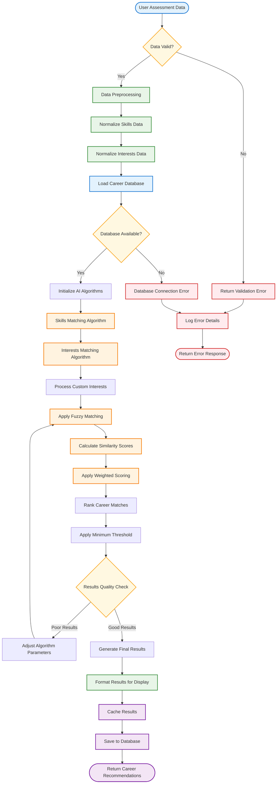
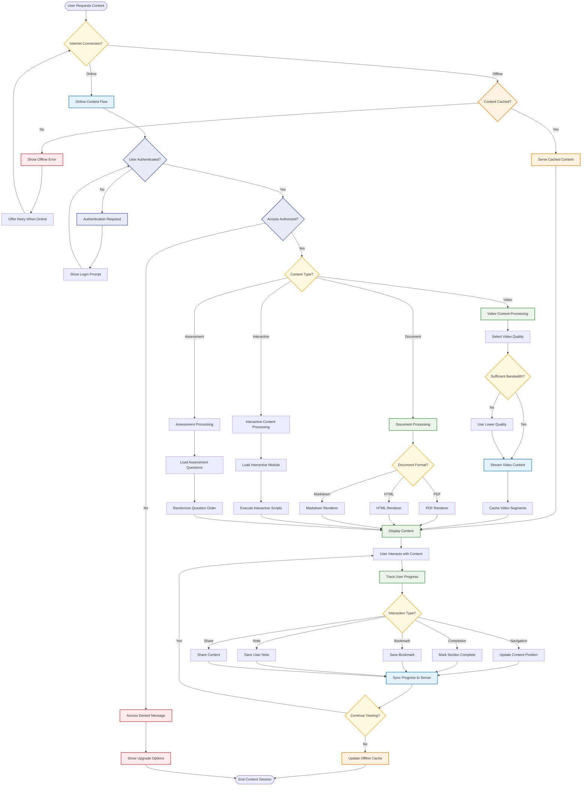

# Flowcharts

## 1. System Decision Making Flow

```mermaid
flowchart TD
    UserEntry([User Accesses Platform]) --> AuthCheck{Authenticated?}
    
    AuthCheck -->|No| AuthFlow[Authentication Flow]
    AuthCheck -->|Yes| ProfileCheck{Profile Complete?}
    
    AuthFlow --> LoginChoice{Login or Register?}
    LoginChoice -->|Login| Login[User Login]
    LoginChoice -->|Register| Register[User Registration]
    
    Login --> LoginValidation{Valid Credentials?}
    LoginValidation -->|No| LoginError[Show Login Error]
    LoginError --> LoginChoice
    LoginValidation -->|Yes| SessionCreate[Create User Session]
    
    Register --> EmailValidation{Valid Email Format?}
    EmailValidation -->|No| EmailError[Show Email Error]
    EmailError --> Register
    EmailValidation -->|Yes| PasswordCheck{Strong Password?}
    PasswordCheck -->|No| PasswordError[Show Password Requirements]
    PasswordError --> Register
    PasswordCheck -->|Yes| CreateAccount[Create User Account]
    CreateAccount --> EmailVerify[Send Verification Email]
    EmailVerify --> SessionCreate
    
    SessionCreate --> ProfileCheck
    ProfileCheck -->|No| ProfileSetup[Profile Setup Required]
    ProfileSetup --> Dashboard[Access Dashboard]
    ProfileCheck -->|Yes| Dashboard
    
    Dashboard --> FeatureSelect{Select Feature}
    
    FeatureSelect -->|Career Assessment| CareerFlow[Career Assessment Flow]
    FeatureSelect -->|Learning| LearningFlow[Learning Flow]
    FeatureSelect -->|Mentorship| MentorshipFlow[Mentorship Flow]
    FeatureSelect -->|Opportunities| OpportunityFlow[Opportunity Flow]
    FeatureSelect -->|Business| BusinessFlow[Business Flow]
    FeatureSelect -->|Profile| ProfileFlow[Profile Management Flow]
    
    %% Career Assessment Flow
    CareerFlow --> AssessmentStatus{Previous Assessment?}
    AssessmentStatus -->|No| NewAssessment[Take New Assessment]
    AssessmentStatus -->|Yes| ViewResults[View Previous Results]
    
    NewAssessment --> SkillsInput[Input Skills & Experience]
    SkillsInput --> InterestsInput[Input Interests]
    InterestsInput --> ProcessAssessment[Process with AI]
    ProcessAssessment --> ResultsReady[Results Generated]
    ResultsReady --> ViewResults
    
    ViewResults --> ResultAction{Action on Results?}
    ResultAction -->|Bookmark| SaveCareer[Save Career Interest]
    ResultAction -->|Learn More| CareerDetails[View Career Details]
    ResultAction -->|Start Learning| LearningFlow
    ResultAction -->|Retake| NewAssessment
    ResultAction -->|Apply Jobs| OpportunityFlow
    
    SaveCareer --> Dashboard
    CareerDetails --> ResultAction
    
    %% Learning Flow
    LearningFlow --> LearningChoice{Learning Choice?}
    LearningChoice -->|Browse Courses| CourseCatalog[Browse Course Catalog]
    LearningChoice -->|Recommended| RecommendedCourses[View Recommended Courses]
    LearningChoice -->|Continue| ContinueLearning[Continue Previous Course]
    
    CourseCatalog --> FilterCourses[Apply Course Filters]
    FilterCourses --> SelectCourse[Select Course]
    RecommendedCourses --> SelectCourse
    ContinueLearning --> ResumeModule[Resume Learning Module]
    
    SelectCourse --> EnrollmentCheck{Enrollment Required?}
    EnrollmentCheck -->|Yes| EnrollProcess[Complete Enrollment]
    EnrollmentCheck -->|No| AccessContent[Access Course Content]
    EnrollProcess --> AccessContent
    
    AccessContent --> ContentType{Content Type?}
    ContentType -->|Video| VideoPlayer[Play Video Content]
    ContentType -->|Text| ReadingMode[Reading Mode]
    ContentType -->|Quiz| TakeQuiz[Take Quiz]
    ContentType -->|Assignment| SubmitAssignment[Submit Assignment]
    
    VideoPlayer --> MarkProgress[Mark Progress]
    ReadingMode --> MarkProgress
    TakeQuiz --> QuizResult{Quiz Passed?}
    QuizResult -->|No| ReviewContent[Review Content]
    ReviewContent --> TakeQuiz
    QuizResult -->|Yes| MarkProgress
    
    SubmitAssignment --> AssignmentGrade[Assignment Grading]
    AssignmentGrade --> MarkProgress
    
    MarkProgress --> ModuleComplete{Module Complete?}
    ModuleComplete -->|No| ContentType
    ModuleComplete -->|Yes| NextModule{More Modules?}
    NextModule -->|Yes| AccessContent
    NextModule -->|No| CourseComplete[Course Completion]
    
    CourseComplete --> Certificate[Generate Certificate]
    Certificate --> Dashboard
    
    ResumeModule --> ContentType
    
    %% Mentorship Flow
    MentorshipFlow --> MentorshipStatus{Current Mentorship?}
    MentorshipStatus -->|Yes| ActiveMentorship[Manage Active Mentorship]
    MentorshipStatus -->|No| FindMentor[Find New Mentor]
    
    ActiveMentorship --> MentorAction{Mentorship Action?}
    MentorAction -->|Schedule| ScheduleMeeting[Schedule Meeting]
    MentorAction -->|Message| SendMessage[Send Message]
    MentorAction -->|Resources| ShareResources[Share Resources]
    MentorAction -->|Feedback| ProvideFeedback[Provide Feedback]
    MentorAction -->|Complete| CompleteMentorship[Complete Mentorship]
    
    ScheduleMeeting --> Dashboard
    SendMessage --> Dashboard
    ShareResources --> Dashboard
    ProvideFeedback --> Dashboard
    CompleteMentorship --> Dashboard
    
    FindMentor --> SearchMentors[Search Available Mentors]
    SearchMentors --> FilterMentors[Apply Mentor Filters]
    FilterMentors --> ViewMentorProfile[View Mentor Profile]
    ViewMentorProfile --> MentorDecision{Request Mentorship?}
    MentorDecision -->|No| SearchMentors
    MentorDecision -->|Yes| SendRequest[Send Mentorship Request]
    SendRequest --> WaitResponse[Wait for Response]
    WaitResponse --> RequestResult{Request Accepted?}
    RequestResult -->|No| SearchMentors
    RequestResult -->|Yes| StartMentorship[Start Mentorship]
    StartMentorship --> Dashboard
    
    %% Opportunity Flow
    OpportunityFlow --> OpportunityType{Opportunity Type?}
    OpportunityType -->|Jobs| BrowseJobs[Browse Job Opportunities]
    OpportunityType -->|Internships| BrowseInternships[Browse Internships]
    OpportunityType -->|Freelance| BrowseFreelance[Browse Freelance Work]
    OpportunityType -->|Volunteer| BrowseVolunteer[Browse Volunteer Opportunities]
    
    BrowseJobs --> ApplyFilters[Apply Job Filters]
    BrowseInternships --> ApplyFilters
    BrowseFreelance --> ApplyFilters
    BrowseVolunteer --> ApplyFilters
    
    ApplyFilters --> ViewOpportunity[View Opportunity Details]
    ViewOpportunity --> EligibilityCheck{Meet Requirements?}
    EligibilityCheck -->|No| SkillGap[Identify Skill Gaps]
    EligibilityCheck -->|Yes| ApplyOpportunity[Apply for Opportunity]
    
    SkillGap --> LearningFlow
    ApplyOpportunity --> TrackApplication[Track Application]
    TrackApplication --> Dashboard
    
    %% Business Flow
    BusinessFlow --> BusinessStage{Business Development Stage?}
    BusinessStage -->|Idea| IdeaValidation[Idea Validation Tools]
    BusinessStage -->|Planning| BusinessPlanning[Business Planning Tools]
    BusinessStage -->|Launch| LaunchSupport[Launch Support Resources]
    BusinessStage -->|Growth| GrowthResources[Growth Resources]
    
    IdeaValidation --> MarketResearch[Market Research Tools]
    MarketResearch --> FeasibilityStudy[Feasibility Study]
    FeasibilityStudy --> BusinessPlanning
    
    BusinessPlanning --> BusinessPlan[Create Business Plan]
    BusinessPlan --> FinancialProjection[Financial Projections]
    FinancialProjection --> FundingOptions[Explore Funding Options]
    FundingOptions --> LaunchSupport
    
    LaunchSupport --> LegalGuidance[Legal Setup Guidance]
    LegalGuidance --> MarketingStrategy[Marketing Strategy]
    MarketingStrategy --> NetworkBuilding[Network Building]
    NetworkBuilding --> GrowthResources
    
    GrowthResources --> ScalingAdvice[Scaling Advice]
    ScalingAdvice --> Dashboard
    
    %% Profile Flow
    ProfileFlow --> ProfileAction{Profile Action?}
    ProfileAction -->|View| ViewProfile[View Current Profile]
    ProfileAction -->|Edit| EditProfile[Edit Profile Information]
    ProfileAction -->|Skills| UpdateSkills[Update Skills Profile]
    ProfileAction -->|Privacy| PrivacySettings[Privacy Settings]
    ProfileAction -->|Account| AccountSettings[Account Settings]
    
    ViewProfile --> Dashboard
    EditProfile --> SaveChanges[Save Profile Changes]
    SaveChanges --> Dashboard
    UpdateSkills --> SkillAssessment[Take Skill Assessment]
    SkillAssessment --> Dashboard
    PrivacySettings --> SavePrivacy[Save Privacy Settings]
    SavePrivacy --> Dashboard
    AccountSettings --> SaveAccount[Save Account Settings]
    SaveAccount --> Dashboard
    
    %% Styling
    classDef auth fill:#e3f2fd,stroke:#1976d2,stroke-width:2px
    classDef assessment fill:#fff3e0,stroke:#f57c00,stroke-width:2px
    classDef learning fill:#e8f5e8,stroke:#388e3c,stroke-width:2px
    classDef mentorship fill:#e8eaf6,stroke:#3f51b5,stroke-width:2px
    classDef opportunity fill:#fce4ec,stroke:#c2185b,stroke-width:2px
    classDef business fill:#f3e5f5,stroke:#7b1fa2,stroke-width:2px
    classDef decision fill:#fff8e1,stroke:#f9a825,stroke-width:2px
    
    class AuthFlow,LoginChoice,Login,Register,SessionCreate auth
    class CareerFlow,NewAssessment,ProcessAssessment,ViewResults assessment
    class LearningFlow,CourseCatalog,SelectCourse,AccessContent,Certificate learning
    class MentorshipFlow,FindMentor,SearchMentors,StartMentorship mentorship
    class OpportunityFlow,BrowseJobs,ApplyOpportunity,TrackApplication opportunity
    class BusinessFlow,BusinessPlanning,LaunchSupport,GrowthResources business
    class AuthCheck,ProfileCheck,FeatureSelect,AssessmentStatus,LearningChoice,MentorshipStatus decision
```

## 2. AI Processing Pipeline

## 3. Content Delivery Flow

## 4. Error Handling and Recovery Flow

```mermaid
flowchart TD
    SystemError([System Error Detected]) --> ErrorType{Error Type?}
    
    ErrorType -->|Authentication| AuthError[Authentication Error]
    ErrorType -->|Network| NetworkError[Network Error]
    ErrorType -->|Database| DatabaseError[Database Error]
    ErrorType -->|Validation| ValidationError[Validation Error]
    ErrorType -->|Permission| PermissionError[Permission Error]
    ErrorType -->|System| SystemError500[Internal Server Error]
    
    AuthError --> AuthErrorType{Auth Error Type?}
    AuthErrorType -->|Invalid Token| RefreshToken[Attempt Token Refresh]
    AuthErrorType -->|Expired Session| SessionExpired[Session Expired Handler]
    AuthErrorType -->|Invalid Credentials| InvalidCreds[Invalid Credentials Handler]
    
    RefreshToken --> RefreshSuccess{Refresh Successful?}
    RefreshSuccess -->|Yes| RetryOperation[Retry Original Operation]
    RefreshSuccess -->|No| ForceLogin[Force User Login]
    
    SessionExpired --> SaveState[Save Current State]
    SaveState --> RedirectLogin[Redirect to Login]
    RedirectLogin --> RestoreState[Restore State After Login]
    
    InvalidCreds --> LoginAttempts{Login Attempts < 3?}
    LoginAttempts -->|Yes| ShowLoginError[Show Login Error Message]
    LoginAttempts -->|No| LockAccount[Temporarily Lock Account]
    ShowLoginError --> RetryLogin[Allow Retry]
    LockAccount --> NotifyAdmin[Notify Administrator]
    
    NetworkError --> NetworkErrorType{Network Error Type?}
    NetworkErrorType -->|Timeout| TimeoutHandler[Connection Timeout Handler]
    NetworkErrorType -->|No Connection| OfflineHandler[Offline Mode Handler]
    NetworkErrorType -->|Server Unreachable| ServerDownHandler[Server Down Handler]
    
    TimeoutHandler --> RetryAttempts{Retry Attempts < 3?}
    RetryAttempts -->|Yes| ExponentialBackoff[Apply Exponential Backoff]
    RetryAttempts -->|No| FailureMessage[Show Failure Message]
    ExponentialBackoff --> RetryOperation
    
    OfflineHandler --> CacheCheck{Offline Content Available?}
    CacheCheck -->|Yes| ServeOfflineContent[Serve Cached Content]
    CacheCheck -->|No| OfflineMessage[Show Offline Message]
    
    ServeOfflineContent --> QueueOperations[Queue Operations for Later]
    OfflineMessage --> RetryWhenOnline[Offer Retry When Online]
    
    ServerDownHandler --> HealthCheck[Check Server Health]
    HealthCheck --> ServerStatus{Server Responding?}
    ServerStatus -->|Yes| RetryOperation
    ServerStatus -->|No| MaintenanceMode[Show Maintenance Message]
    
    DatabaseError --> DatabaseErrorType{Database Error Type?}
    DatabaseErrorType -->|Connection Lost| ReconnectDB[Attempt Database Reconnect]
    DatabaseErrorType -->|Query Failed| QueryRetry[Retry Database Query]
    DatabaseErrorType -->|Data Corruption| DataRecovery[Initiate Data Recovery]
    
    ReconnectDB --> ReconnectSuccess{Reconnection Successful?}
    ReconnectSuccess -->|Yes| RetryOperation
    ReconnectSuccess -->|No| BackupDatabase[Switch to Backup Database]
    
    QueryRetry --> QueryAttempts{Query Attempts < 3?}
    QueryAttempts -->|Yes| ModifyQuery[Modify Query Parameters]
    QueryAttempts -->|No| QueryFailure[Report Query Failure]
    ModifyQuery --> RetryOperation
    
    DataRecovery --> RecoveryProcess[Start Recovery Process]
    RecoveryProcess --> NotifyAdmin
    
    ValidationError --> ValidationErrorType{Validation Error Type?}
    ValidationErrorType -->|Client Side| ClientValidation[Client-Side Validation Error]
    ValidationErrorType -->|Server Side| ServerValidation[Server-Side Validation Error]
    ValidationErrorType -->|Business Rules| BusinessRuleError[Business Rule Violation]
    
    ClientValidation --> HighlightFields[Highlight Invalid Fields]
    HighlightFields --> ShowFieldErrors[Show Field-Specific Errors]
    ShowFieldErrors --> AllowCorrection[Allow User Correction]
    
    ServerValidation --> DetailedError[Show Detailed Error Message]
    DetailedError --> SuggestCorrection[Suggest Corrections]
    SuggestCorrection --> AllowCorrection
    
    BusinessRuleError --> ExplainRule[Explain Business Rule]
    ExplainRule --> AlternativeAction[Suggest Alternative Actions]
    
    PermissionError --> PermissionType{Permission Type?}
    PermissionType -->|Insufficient Role| RoleError[Insufficient Role Error]
    PermissionType -->|Feature Not Available| FeatureError[Feature Not Available Error]
    PermissionType -->|Account Suspended| SuspensionError[Account Suspension Error]
    
    RoleError --> UpgradeAccount[Suggest Account Upgrade]
    FeatureError --> ShowAlternatives[Show Alternative Features]
    SuspensionError --> ContactSupport[Provide Support Contact]
    
    SystemError500 --> CriticalError[Critical System Error]
    CriticalError --> ErrorLogging[Log Error Details]
    ErrorLogging --> NotifyAdmin
    NotifyAdmin --> EmergencyProtocol[Initiate Emergency Protocol]
    
    RetryOperation --> OperationSuccess{Operation Successful?}
    OperationSuccess -->|Yes| SuccessRecovery[Recovery Successful]
    OperationSuccess -->|No| EscalateError[Escalate Error]
    
    SuccessRecovery --> LogRecovery[Log Successful Recovery]
    LogRecovery --> ContinueNormal[Continue Normal Operation]
    
    EscalateError --> AdminNotification[Send Admin Notification]
    AdminNotification --> UserApology[Show User Apology Message]
    UserApology --> GracefulDegradation[Provide Graceful Degradation]
    
    AllowCorrection --> RetryOperation
    MaintenanceMode --> ScheduledRetry[Schedule Automatic Retry]
    FailureMessage --> ManualRetry[Allow Manual Retry]
    QueueOperations --> ProcessWhenOnline[Process When Connection Restored]
    
    %% Styling
    classDef error fill:#ffebee,stroke:#d32f2f,stroke-width:2px
    classDef recovery fill:#e8f5e8,stroke:#388e3c,stroke-width:2px
    classDef decision fill:#fff8e1,stroke:#f9a825,stroke-width:2px
    classDef critical fill:#f3e5f5,stroke:#7b1fa2,stroke-width:2px
    classDef user fill:#e3f2fd,stroke:#1976d2,stroke-width:2px
    
    class AuthError,NetworkError,DatabaseError,ValidationError,PermissionError,SystemError500 error
    class RetryOperation,SuccessRecovery,ServeOfflineContent,BackupDatabase recovery
    class ErrorType,AuthErrorType,RefreshSuccess,NetworkErrorType,OperationSuccess decision
    class CriticalError,EmergencyProtocol,EscalateError critical
    class ShowLoginError,AllowCorrection,UserApology,GracefulDegradation user
```

## Flowchart Explanations

### 1. System Decision Making Flow
**Purpose**: Comprehensive user navigation and feature access logic
**Key Features**:
- Multi-layered authentication and authorization
- Feature-specific workflows with cross-connections
- Complete user journey mapping from entry to completion
- Error handling integrated into normal flow

**Flow Highlights**:
- Clear decision points for every user interaction
- Seamless transitions between different platform features
- Built-in validation at every critical step
- User-friendly error recovery mechanisms

### 2. AI Processing Pipeline
**Purpose**: Detailed AI algorithm execution for career recommendations
**Key Features**:
- Robust data validation and preprocessing
- Multiple AI algorithms working in sequence
- Quality assurance with parameter adjustment
- Comprehensive error handling and logging

**Flow Highlights**:
- Step-by-step AI processing with validation gates
- Self-adjusting algorithms for optimal results
- Efficient caching and database operations
- Clear separation of concerns for maintainability

### 3. Content Delivery Flow
**Purpose**: Intelligent content delivery with offline support
**Key Features**:
- Adaptive content delivery based on connection status
- Multi-format content support (video, documents, interactive)
- Progressive content loading with quality adaptation
- Comprehensive progress tracking and synchronization

**Flow Highlights**:
- Seamless online/offline content access
- Intelligent bandwidth management
- Real-time progress synchronization
- User interaction tracking for engagement analytics

### 4. Error Handling and Recovery Flow
**Purpose**: Comprehensive error management and system resilience
**Key Features**:
- Multi-layered error classification and handling
- Automatic recovery mechanisms with fallback options
- User-friendly error messages with actionable guidance
- Administrative escalation for critical issues

**Flow Highlights**:
- Proactive error prevention and detection
- Graceful degradation strategies
- Clear user communication during error states
- Systematic error logging and administrative notifications

## Technical Implementation Benefits

### User Experience
- **Seamless Navigation**: Clear decision trees ensure users always know their next steps
- **Error Resilience**: Comprehensive error handling maintains user confidence
- **Performance Optimization**: Intelligent content delivery adapts to user conditions
- **Progress Preservation**: State management ensures no loss of user progress

### System Reliability
- **Fault Tolerance**: Multiple recovery mechanisms prevent system failures
- **Scalability**: Modular flow design supports system growth
- **Maintainability**: Clear separation of concerns simplifies updates
- **Monitoring**: Built-in logging provides system health visibility

### Business Value
- **User Retention**: Smooth experiences reduce abandonment rates
- **Operational Efficiency**: Automated error handling reduces support costs
- **Data Quality**: Validation flows ensure clean, reliable data
- **Compliance**: Systematic permission handling supports regulatory requirements
