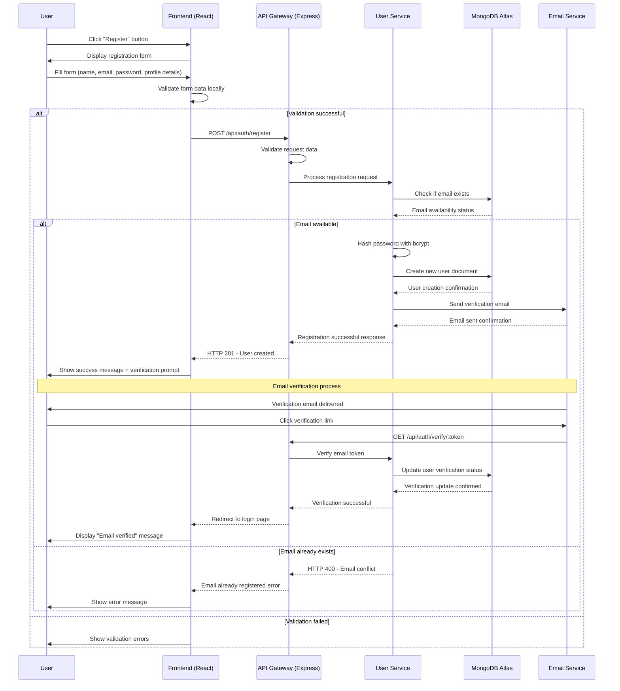
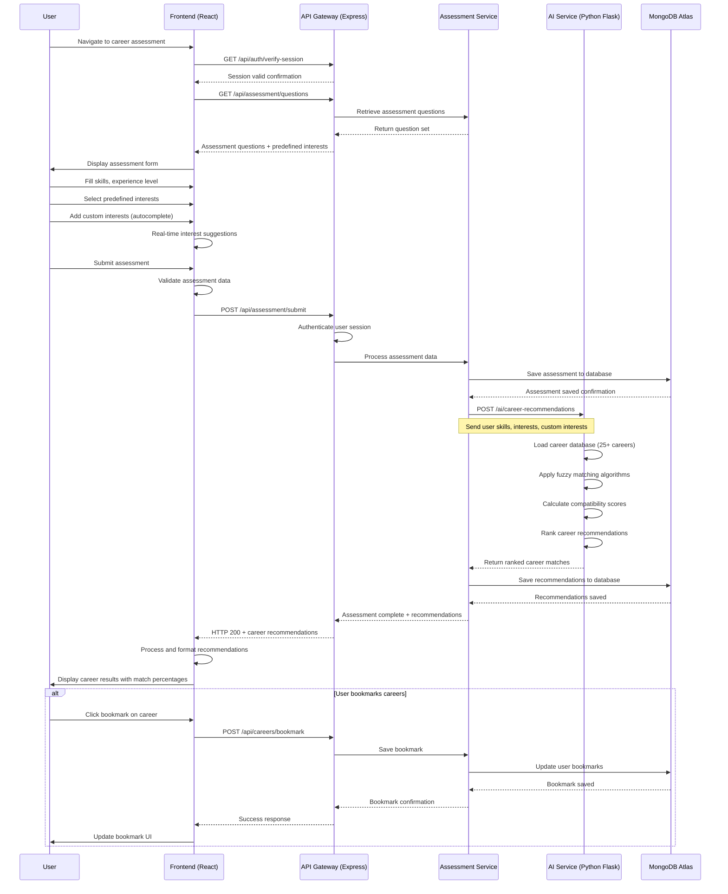
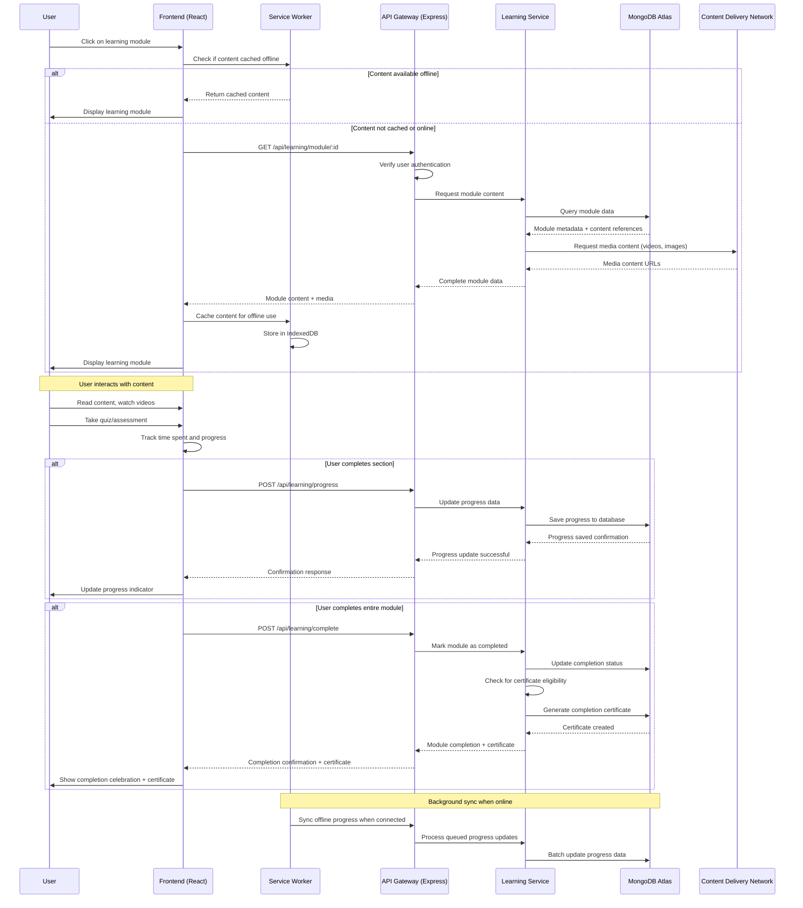
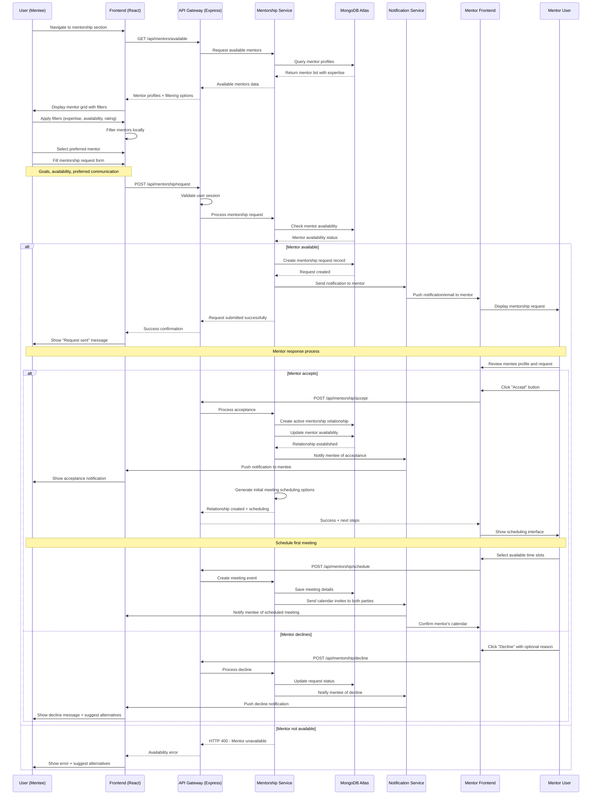

# Sequence Diagrams

## 1. User Registration Process

## 2. Career Assessment Flow

## 3. Learning Module Access

## 4. Mentorship Matching

## Sequence Diagram Explanations

### 1. User Registration Process
**Purpose**: Secure user onboarding with email verification
**Key Features**:
- Form validation (client and server-side)
- Email uniqueness checking
- Password hashing with bcrypt
- Email verification workflow
- Error handling for conflicts

**Flow Highlights**:
- Multi-layer validation ensures data integrity
- Asynchronous email verification allows immediate platform access
- Clear user feedback throughout the process

### 2. Career Assessment Flow
**Purpose**: AI-powered career recommendation generation
**Key Features**:
- Dynamic question loading
- Custom interest input with autocomplete
- AI processing with fuzzy matching
- Real-time recommendation generation
- Bookmark functionality for future reference

**Flow Highlights**:
- Seamless integration between frontend and AI services
- Persistent storage of assessments and recommendations
- User engagement through interactive elements

### 3. Learning Module Access
**Purpose**: Content delivery with offline capability
**Key Features**:
- Offline-first architecture with Service Worker
- Progressive content loading
- Real-time progress tracking
- Certificate generation upon completion
- Background synchronization

**Flow Highlights**:
- Intelligent caching strategy for low-bandwidth environments
- Seamless online/offline transitions
- Comprehensive progress tracking and certification

### 4. Mentorship Matching
**Purpose**: Intelligent mentor-mentee connection process
**Key Features**:
- Advanced filtering and search capabilities
- Structured request and approval workflow
- Automated notification system
- Integrated scheduling functionality
- Feedback and rating mechanisms

**Flow Highlights**:
- User-driven mentor selection process
- Clear communication channels between parties
- Automated workflow management
- Calendar integration for meeting coordination

## Technical Implementation Notes

### Authentication & Security
- JWT token-based authentication
- Session validation on sensitive operations
- Password hashing with bcrypt
- Secure email verification process

### Data Management
- MongoDB Atlas for scalable data storage
- Real-time data synchronization
- Efficient querying and indexing
- Data validation at multiple layers

### Performance Optimization
- Service Worker for offline functionality
- Content Delivery Network for media
- Progressive loading strategies
- Local caching and storage

### User Experience
- Real-time feedback and updates
- Intuitive error handling
- Progressive disclosure of information
- Mobile-responsive interaction patterns
