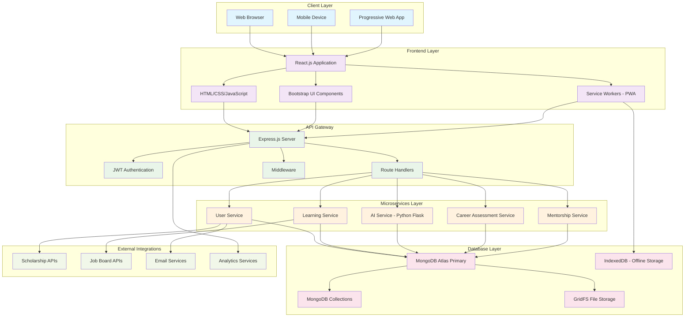

# System Architecture Diagram

## Architecture Description

### Client Layer
- **Web Browser**: Desktop and laptop access
- **Mobile Device**: Smartphone and tablet access
- **Progressive Web App**: App-like experience with offline capabilities

### Frontend Layer
- **React.js Application**: Main user interface framework
- **HTML/CSS/JavaScript**: Core web technologies
- **Bootstrap UI Components**: Responsive design framework
- **Service Workers**: Enables offline functionality and caching

### API Gateway
- **Express.js Server**: Main backend server
- **JWT Authentication**: Secure token-based authentication
- **Route Handlers**: API endpoint management
- **Middleware**: Cross-cutting concerns (logging, validation, CORS)

### Microservices Layer
- **User Service**: User management, authentication, profiles
- **Learning Service**: Course content, progress tracking
- **AI Service**: Career recommendations, matching algorithms
- **Career Assessment Service**: Skills evaluation, interest analysis
- **Mentorship Service**: Mentor-mentee matching and communication

### Database Layer
- **MongoDB Atlas Primary**: Main cloud database
- **MongoDB Collections**: Structured data storage
- **GridFS File Storage**: Large file storage (images, videos)
- **IndexedDB**: Client-side offline storage

### External Integrations
- **Scholarship APIs**: External funding opportunities
- **Job Board APIs**: Employment opportunities
- **Email Services**: Notifications and communications
- **Analytics Services**: User behavior tracking and insights
