# Use Case Diagram

```mermaid
graph TB
    %% Actors
    RefugeeYouth[👤 Refugee Youth]
    Mentor[👨‍🏫 Mentor]
    Admin[👨‍💼 System Admin]
    ExternalSystems[🌐 External Systems]
    
    %% System Boundary
    subgraph "Refugee Techpreneurs Platform"
        %% Authentication Use Cases
        UC1[Register Account]
        UC2[Login/Logout]
        UC3[Manage Profile]
        
        %% Career Assessment Use Cases
        UC4[Take Career Assessment]
        UC5[Add Custom Interests]
        UC6[View Career Recommendations]
        UC7[Bookmark Career Paths]
        
        %% Learning Use Cases
        UC8[Browse Learning Modules]
        UC9[Complete Courses]
        UC10[Track Learning Progress]
        UC11[Access Offline Content]
        
        %% Mentorship Use Cases
        UC12[Search Mentors]
        UC13[Request Mentorship]
        UC14[Communicate with Mentee]
        UC15[Schedule Meetings]
        UC16[Provide Career Guidance]
        
        %% Opportunity Use Cases
        UC17[Browse Opportunities]
        UC18[Apply for Scholarships]
        UC19[Apply for Jobs]
        UC20[Track Applications]
        
        %% Startup Use Cases
        UC21[Access Startup Toolkit]
        UC22[Create Business Plan]
        UC23[Validate Business Ideas]
        UC24[Pitch Preparation]
        
        %% Admin Use Cases
        UC25[Manage Users]
        UC26[Moderate Content]
        UC27[Monitor System Performance]
        UC28[Generate Reports]
        
        %% System Integration Use Cases
        UC29[Sync External Opportunities]
        UC30[Send Notifications]
        UC31[Analytics Tracking]
    end
    
    %% Refugee Youth Connections
    RefugeeYouth --> UC1
    RefugeeYouth --> UC2
    RefugeeYouth --> UC3
    RefugeeYouth --> UC4
    RefugeeYouth --> UC5
    RefugeeYouth --> UC6
    RefugeeYouth --> UC7
    RefugeeYouth --> UC8
    RefugeeYouth --> UC9
    RefugeeYouth --> UC10
    RefugeeYouth --> UC11
    RefugeeYouth --> UC12
    RefugeeYouth --> UC13
    RefugeeYouth --> UC17
    RefugeeYouth --> UC18
    RefugeeYouth --> UC19
    RefugeeYouth --> UC20
    RefugeeYouth --> UC21
    RefugeeYouth --> UC22
    RefugeeYouth --> UC23
    RefugeeYouth --> UC24
    
    %% Mentor Connections
    Mentor --> UC2
    Mentor --> UC3
    Mentor --> UC14
    Mentor --> UC15
    Mentor --> UC16
    
    %% Admin Connections
    Admin --> UC2
    Admin --> UC25
    Admin --> UC26
    Admin --> UC27
    Admin --> UC28
    
    %% External Systems Connections
    ExternalSystems --> UC29
    ExternalSystems --> UC30
    ExternalSystems --> UC31
    
    %% Include/Extend Relationships
    UC4 -.->|extends| UC5
    UC6 -.->|includes| UC4
    UC13 -.->|includes| UC12
    UC18 -.->|includes| UC17
    UC19 -.->|includes| UC17
    UC22 -.->|includes| UC21
    UC23 -.->|includes| UC21
    UC24 -.->|includes| UC21
    
    %% Styling
    classDef actor fill:#e3f2fd
    classDef usecase fill:#f3e5f5
    classDef system fill:#e8f5e8
    
    class RefugeeYouth,Mentor,Admin,ExternalSystems actor
    class UC1,UC2,UC3,UC4,UC5,UC6,UC7,UC8,UC9,UC10,UC11,UC12,UC13,UC14,UC15,UC16,UC17,UC18,UC19,UC20,UC21,UC22,UC23,UC24,UC25,UC26,UC27,UC28,UC29,UC30,UC31 usecase
```

## Use Case Descriptions

### Primary Actors

#### Refugee Youth (Primary User)
- **Goal**: Access educational resources, career guidance, and opportunities for personal and professional development
- **Responsibilities**: Complete assessments, engage with learning content, participate in mentorship

#### Mentor (Secondary User)
- **Goal**: Provide guidance and support to refugee youth
- **Responsibilities**: Share expertise, communicate regularly, provide career advice

#### System Administrator
- **Goal**: Maintain platform functionality and user experience
- **Responsibilities**: User management, content moderation, system monitoring

#### External Systems
- **Goal**: Provide integrated services and data
- **Responsibilities**: Supply opportunity data, deliver notifications, track analytics

### Key Use Case Categories

#### 1. User Management
- **Register Account**: New user registration with profile creation
- **Login/Logout**: Secure authentication and session management
- **Manage Profile**: Update personal information and preferences

#### 2. Career Assessment & Planning
- **Take Career Assessment**: AI-powered skills and interest evaluation
- **Add Custom Interests**: Personalized interest input beyond predefined options
- **View Career Recommendations**: AI-generated career suggestions
- **Bookmark Career Paths**: Save interesting career options for future reference

#### 3. Learning & Development
- **Browse Learning Modules**: Explore available educational content
- **Complete Courses**: Engage with structured learning materials
- **Track Learning Progress**: Monitor advancement through courses
- **Access Offline Content**: Use cached content without internet connectivity

#### 4. Mentorship
- **Search Mentors**: Find mentors based on expertise and availability
- **Request Mentorship**: Initiate mentor-mentee relationships
- **Communicate with Mentee**: Ongoing guidance and support
- **Schedule Meetings**: Coordinate mentorship sessions

#### 5. Opportunities
- **Browse Opportunities**: Explore scholarships, jobs, and funding options
- **Apply for Scholarships**: Submit applications for educational funding
- **Apply for Jobs**: Apply for employment opportunities
- **Track Applications**: Monitor application status and outcomes

#### 6. Entrepreneurship
- **Access Startup Toolkit**: Use business development resources
- **Create Business Plan**: Develop comprehensive business strategies
- **Validate Business Ideas**: Test and refine business concepts
- **Pitch Preparation**: Prepare presentations for investors and stakeholders
